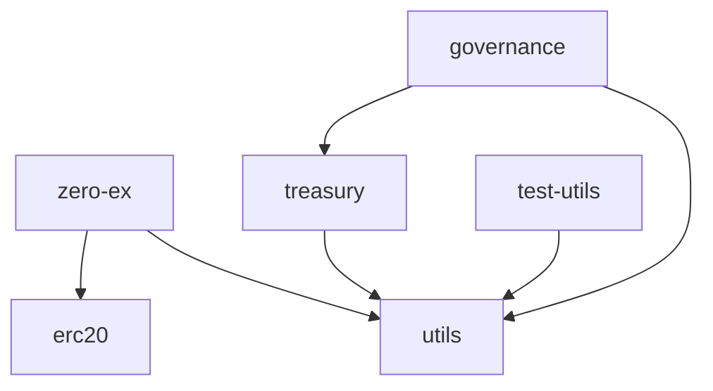

# 0x Protocol Contracts

## 🏗️ 合约结构总览

0x Protocol采用了模块化的合约架构设计，每个模块负责特定的功能领域。

### 📁 模块组织

```
contracts/
├── zero-ex/        # 核心协议实现
├── governance/     # 治理机制
├── treasury/       # 国库管理
├── erc20/         # 代币实现
├── utils/         # 工具库
└── test-utils/    # 测试工具
```

### 🔗 模块详细说明

#### Zero-Ex（核心协议）

主要负责订单撮合、流动性聚合和协议的核心功能。

**架构特点：**
- Per-function代理模式
- 模块化的Feature系统
- 可升级的功能实现

**主要Features：**
| Feature | 功能描述 |
|---------|----------|
| TransformERC20 | ERC20代币转换和流动性聚合 |
| NativeOrders | 原生限价订单 |
| OtcOrders | OTC场外交易订单 |
| UniswapV2/V3 | Uniswap协议集成 |
| PancakeSwap | PancakeSwap集成 |
| MetaTransactions | 元交易支持 |
| NFTOrders | NFT交易功能 |

#### Governance（治理）

实现了完全去中心化的链上治理。

**核心组件：**
- **ZRXWrappedToken**: 1:1封装的ZRX代币，用于投票
- **ZeroExVotes**: 投票权管理（可升级）
- **ZeroExProtocolGovernor**: 协议参数治理
- **ZeroExTreasuryGovernor**: 国库资金治理
- **ZeroExTimelock**: 时间锁机制
- **SecurityCouncil**: 紧急情况处理

**治理参数：**
- 提案阈值：1,000,000 ZRX
- 投票期：3天
- 时间锁延迟：协议2天，国库3天

#### Treasury（国库）

管理协议收入和资金分配。

**主要功能：**
- 协议费用收集
- Staking奖励分配
- 资金管理和分配
- 默认池操作

#### ERC20（代币）

提供标准代币实现和工具。

**包含内容：**
- ZRX Token实现
- WETH9（Wrapped Ether）
- ERC20工具库
- 代币接口定义

#### Utils（工具库）

为其他模块提供基础功能支持。

**核心库：**
- **LibBytes**: 字节数组操作
- **LibMath**: 安全数学运算
- **LibRichErrors**: 丰富的错误处理
- **Ownable/Authorizable**: 权限管理

### 🔧 技术规范

#### Solidity版本
- 统一使用 Solidity 0.8.28
- EVM目标：cancun
- 优化器：启用，运行次数200-1,000,000

#### 编译配置

每个模块都有独立的`foundry.toml`配置文件：

```toml
[profile.default]
solc_version = "0.8.28"
optimizer = true
optimizer_runs = 1000000
evm_version = "cancun"
```

#### 测试框架
- 使用Foundry进行合约测试
- 部分模块支持Hardhat测试
- 测试覆盖率要求：>90%

### 🚀 开发指南

#### 编译合约
```bash
# 编译特定模块
cd contracts/[module-name]
forge build

# 编译所有合约
yarn build:contracts
```

#### 运行测试
```bash
# 测试特定模块
cd contracts/[module-name]
forge test

# 运行所有测试
yarn test:contracts
```

#### 部署合约
查看各模块的`script/`目录获取部署脚本。

### 📊 依赖关系图



### 🔐 安全考虑

1. **审计状态**: 主要合约已通过多次安全审计
2. **升级机制**: 仅投票合约可升级，核心协议不可升级
3. **权限管理**: 多签和时间锁保护关键操作
4. **紧急响应**: 安全委员会可处理紧急情况

### 📚 更多资源

- [协议规范](https://protocol.0x.org/)
- [开发者文档](https://0x.org/docs/)
- [审计报告](./governance/README.md)

---

## 开发说明

构建 Solidity 文件将会更新 `{package-name}/generated-artifacts/{contract}.json` 中的合约工件，但不会自动更新从工件 JSON 生成的 `contract-artifacts` 或 `contract-wrappers` 包。查看 `contract-artifacts/README.md` 获取更新这些包的说明。
