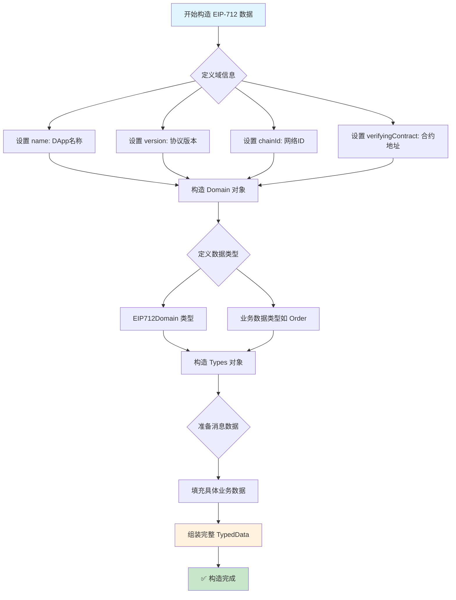
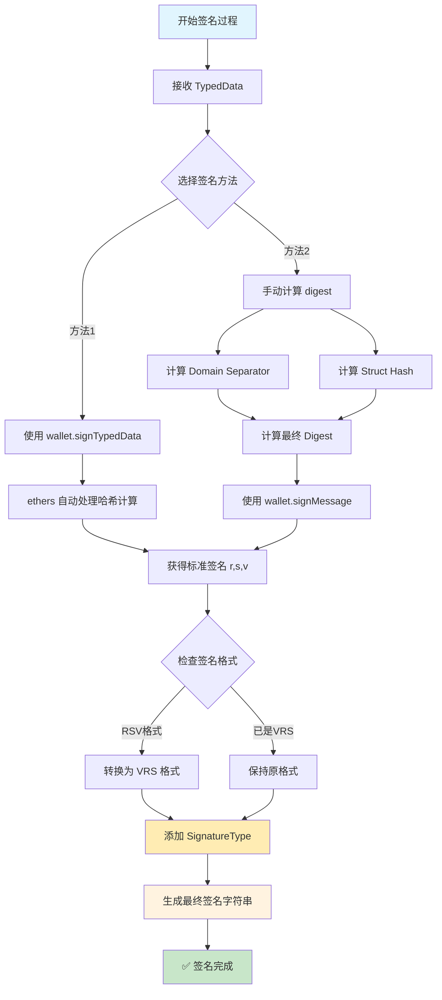
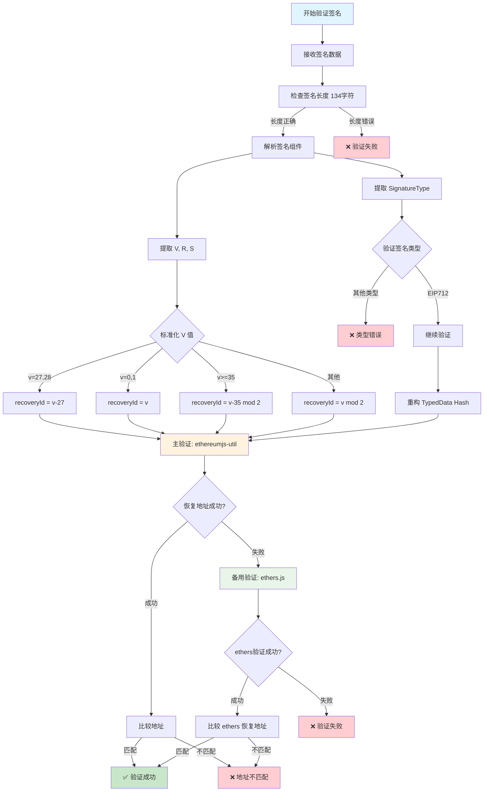

# EIP-712 签名完整流程指南

## 📋 概述

EIP-712 (Ethereum Improvement Proposal 712) 是以太坊的类型化结构化数据签名标准，提供了安全、可读的链下签名机制。本文档详细描述了 EIP-712 签名的三个核心流程：**构造**、**签名**、**验证**。

## 🎯 核心优势

- **🔒 安全性**: 防止重放攻击，绑定特定域和链
- **👁️ 可读性**: 用户可以清楚看到签名内容
- **⚡ 效率**: 链下生成，链上验证，节省 gas
- **🌐 兼容性**: 支持所有 EIP-155 兼容网络

---

## 🏗️ 流程一：EIP-712 数据构造

### 📊 数据结构组成

EIP-712 签名数据由三个核心部分组成：

```typescript
interface EIP712TypedData {
    domain: EIP712Domain;     // 域分隔符
    types: Record<string, EIP712Type[]>;  // 类型定义
    message: any;             // 消息数据
}
```

### 🔧 1.1 域分隔符 (Domain Separator)

域分隔符用于隔离不同应用和网络，防止跨域重放攻击：

```typescript
interface EIP712Domain {
    name: string;              // DApp 名称，如 "0x Protocol"
    version: string;           // 协议版本，如 "3.0.0"
    chainId: number;           // 链 ID，如 1 (主网)、1337 (Hardhat)
    verifyingContract: string; // 验证合约地址
    salt?: string;             // 可选盐值，增强唯一性
}
```

### 📝 1.2 类型定义 (Types Schema)

定义消息的数据结构，如订单类型：

```typescript
const types = {
    EIP712Domain: [
        { name: 'name', type: 'string' },
        { name: 'version', type: 'string' },
        { name: 'chainId', type: 'uint256' },
        { name: 'verifyingContract', type: 'address' }
    ],
    Order: [
        { name: 'makerAddress', type: 'address' },
        { name: 'takerAddress', type: 'address' },
        { name: 'feeRecipientAddress', type: 'address' },
        { name: 'senderAddress', type: 'address' },
        { name: 'makerAssetAmount', type: 'uint256' },
        { name: 'takerAssetAmount', type: 'uint256' },
        { name: 'makerFee', type: 'uint256' },
        { name: 'takerFee', type: 'uint256' },
        { name: 'expirationTimeSeconds', type: 'uint256' },
        { name: 'salt', type: 'uint256' },
        { name: 'makerAssetData', type: 'bytes' },
        { name: 'takerAssetData', type: 'bytes' },
        { name: 'makerFeeAssetData', type: 'bytes' },
        { name: 'takerFeeAssetData', type: 'bytes' }
    ]
};
```

### 💾 1.3 消息数据 (Message)

具体的订单实例：

```typescript
const message = {
    makerAddress: '0xf39Fd6e51aad88F6F4ce6aB8827279cffFb92266',
    takerAddress: '0x0000000000000000000000000000000000000000',
    feeRecipientAddress: '0x0000000000000000000000000000000000000000',
    senderAddress: '0x0000000000000000000000000000000000000000',
    makerAssetAmount: '1000000000000000000',
    takerAssetAmount: '2000000000000000000',
    makerFee: '0',
    takerFee: '0',
    expirationTimeSeconds: '1640995200',
    salt: '12345678901234567890',
    makerAssetData: '0x...',
    takerAssetData: '0x...',
    makerFeeAssetData: '0x...',
    takerFeeAssetData: '0x...'
};
```

---

## ✍️ 流程二：EIP-712 签名生成

### 🔢 2.1 哈希计算流程

EIP-712 签名的核心是正确计算结构化数据哈希：

```typescript
// 1. 计算 Type Hash
const typeHash = keccak256("Order(address makerAddress,address takerAddress,...)");

// 2. 计算 Domain Separator Hash
const domainSeparator = keccak256(encode(EIP712Domain, domain));

// 3. 计算 Struct Hash
const structHash = keccak256(encode(Order, message));

// 4. 计算最终 Digest
const digest = keccak256("\x19\x01" + domainSeparator + structHash);
```

### 🔑 2.2 实际签名过程

使用 ethers.js v6 进行签名：

```typescript
// 方法 1: 使用 ethers.js 的 signTypedData
const signature = await wallet.signTypedData(domain, types, message);

// 方法 2: 使用计算好的 digest
const digest = ethers.TypedDataEncoder.hash(domain, types, message);
const signature = await wallet.signMessage(ethers.getBytes(digest));
```

### 📦 2.3 签名格式处理

0x Protocol 使用特定的签名格式：

```typescript
// 标准 ethers 签名: 0x + r(32) + s(32) + v(1) = 130 字符
// 0x Protocol 格式: 0x + v(1) + r(32) + s(32) + signatureType(1) = 134 字符

function convertToVRS(signature: string, signatureType: SignatureType): string {
    const sig = ethers.Signature.from(signature);
    
    // 转换为 VRS 格式并添加签名类型
    const vrsSignature = 
        '0x' + 
        sig.v.toString(16).padStart(2, '0') +     // V (1 byte)
        sig.r.slice(2) +                          // R (32 bytes)
        sig.s.slice(2) +                          // S (32 bytes)
        signatureType.toString(16).padStart(2, '0'); // SignatureType (1 byte)
    
    return vrsSignature;
}
```

---

## ✅ 流程三：EIP-712 签名验证

### 🔍 3.1 签名解析

首先解析 0x Protocol 格式的签名：

```typescript
function parseSignatureWithType(signatureHex: string): {
    signature: ECSignature;
    signatureType: number;
} {
    if (signatureHex.length !== 134) {
        throw new Error(`Invalid signature length: expected 134 characters`);
    }
    
    // 提取各部分
    const signatureTypeHex = signatureHex.slice(-2);           // 最后 2 字符
    const signatureType = parseInt(signatureTypeHex, 16);
    
    const vrsHex = '0x' + signatureHex.slice(2, -2);          // 去掉前缀和类型
    const signature = parseSignatureHexAsVRS(vrsHex);
    
    return { signature, signatureType };
}

function parseSignatureHexAsVRS(signatureHex: string): ECSignature {
    const signatureBuffer = ethUtil.toBuffer(signatureHex);
    
    let v = signatureBuffer[0];                    // V (第1字节)
    const r = signatureBuffer.slice(1, 33);       // R (第2-33字节)
    const s = signatureBuffer.slice(33, 65);      // S (第34-65字节)
    
    // 处理不同的 V 值格式
    if (v < 27) {
        v += 27;  // 0,1 -> 27,28
    }
    
    return {
        v,
        r: ethUtil.bufferToHex(r),
        s: ethUtil.bufferToHex(s)
    };
}
```

### 🔐 3.2 EIP-712 专用验证

验证 EIP-712 类型的签名：

```typescript
function isValidEIP712Signature(
    typedDataHash: string,
    signatureWithType: string,
    signerAddress: string
): boolean {
    try {
        // 1. 解析签名
        const { signature, signatureType } = parseSignatureWithType(signatureWithType);
        
        // 2. 验证签名类型
        if (signatureType !== SignatureType.EIP712) {
            return false;
        }
        
        // 3. 验证 EC 签名
        return isValidECSignature(typedDataHash, signature, signerAddress);
    } catch (err) {
        return false;
    }
}
```

### 🛡️ 3.3 核心 EC 签名验证

使用双重验证机制确保兼容性：

```typescript
function isValidECSignature(data: string, signature: ECSignature, signerAddress: string): boolean {
    const normalizedSignerAddress = signerAddress.toLowerCase();
    
    try {
        // 主验证：使用 ethereumjs-util
        const msgHashBuff = ethUtil.toBuffer(data);
        
        // V 值标准化处理
        let recoveryId: number;
        if (signature.v === 27 || signature.v === 28) {
            recoveryId = signature.v - 27;           // 传统格式: 27,28 -> 0,1
        } else if (signature.v === 0 || signature.v === 1) {
            recoveryId = signature.v;                // 原始格式: 0,1 -> 0,1
        } else if (signature.v >= 35) {
            recoveryId = (signature.v - 35) % 2;     // EIP-155: 计算恢复ID
        } else {
            recoveryId = signature.v % 2;            // 其他: 确保0或1
        }
        
        // 恢复公钥并验证地址
        const pubKey = ethUtil.ecrecover(
            msgHashBuff, 
            recoveryId, 
            ethUtil.toBuffer(signature.r), 
            ethUtil.toBuffer(signature.s)
        );
        const retrievedAddress = ethUtil.bufferToHex(ethUtil.pubToAddress(pubKey));
        
        return retrievedAddress.toLowerCase() === normalizedSignerAddress;
        
    } catch (err) {
        // 备用验证：使用 ethers.js
        try {
            const ethersSignature = ethers.Signature.from({
                r: signature.r,
                s: signature.s,
                v: signature.v
            });
            const recoveredAddress = ethers.verifyMessage(ethers.getBytes(data), ethersSignature);
            return recoveredAddress.toLowerCase() === normalizedSignerAddress;
        } catch (ethersErr) {
            return false;
        }
    }
}
```

---

## 📊 完整流程图

### 🏗️ 流程图 1: EIP-712 数据构造



### ✍️ 流程图 2: EIP-712 签名生成



### ✅ 流程图 3: EIP-712 签名验证



---

## 🔧 实际代码示例

### 📝 完整的签名流程示例

```typescript
import { ethers } from 'ethers';
import { eip712Utils, orderHashUtils, signatureUtils } from '@0x/order-utils';

async function completeEIP712Example() {
    // 1. 设置环境
    const provider = new ethers.JsonRpcProvider('http://127.0.0.1:8545');
    const wallet = new ethers.Wallet('0x...', provider);
    
    // 2. 构造订单数据
    const order = {
        makerAddress: wallet.address,
        takerAddress: '0x0000000000000000000000000000000000000000',
        feeRecipientAddress: '0x0000000000000000000000000000000000000000',
        senderAddress: '0x0000000000000000000000000000000000000000',
        makerAssetAmount: 1000000000000000000n,
        takerAssetAmount: 2000000000000000000n,
        makerFee: 0n,
        takerFee: 0n,
        expirationTimeSeconds: BigInt(Date.now() + 3600000),
        salt: BigInt(Math.random() * 1e18),
        makerAssetData: '0x...',
        takerAssetData: '0x...',
        makerFeeAssetData: '0x...',
        takerFeeAssetData: '0x...',
        exchangeAddress: '0x1dc4c1cefef38a777b15aa20260a54e584b16c48',
        chainId: 1337
    };
    
    // 3. 构造 EIP-712 类型化数据
    const typedData = eip712Utils.createOrderTypedData(order);
    
    // 4. 生成签名
    const signature = await wallet.signTypedData(
        typedData.domain,
        { Order: typedData.types.Order },
        typedData.message
    );
    
    // 5. 转换为 0x Protocol 格式
    const signatureWithType = signature + '02'; // EIP712 类型
    
    // 6. 验证签名
    const orderHash = orderHashUtils.getOrderHash(order);
    const isValid = signatureUtils.isValidEIP712Signature(
        orderHash,
        signatureWithType,
        wallet.address
    );
    
    console.log('签名验证结果:', isValid); // true
}
```

---

## 🔍 关键注意事项

### ⚠️ 常见问题

1. **V 值处理**: 不同网络和工具可能使用不同的 V 值编码
2. **字段顺序**: EIP712Domain 字段必须按标准顺序定义
3. **类型匹配**: Types 定义必须与 Solidity 合约完全一致
4. **链ID绑定**: chainId 必须与当前网络匹配防止重放攻击

### 🛡️ 安全建议

1. **验证域信息**: 确保 verifyingContract 地址正确
2. **检查过期时间**: 实现 nonce 或 expiry 机制
3. **双重验证**: 使用多种库进行签名验证
4. **错误处理**: 妥善处理各种验证失败情况

### 🚀 性能优化

1. **缓存哈希计算**: 复用 Domain Separator 计算结果
2. **批量验证**: 对多个签名进行批量处理
3. **早期退出**: 在类型验证失败时快速返回

---

## 📚 参考资源

- [EIP-712 官方规范](https://eips.ethereum.org/EIPS/eip-712)
- [EIP-155 规范](https://eips.ethereum.org/EIPS/eip-155)
- [ethers.js 文档](https://docs.ethers.org/)
- [0x Protocol 文档](https://docs.0x.org/)

---

**🎉 这份指南涵盖了 EIP-712 签名的完整流程，从数据构造到最终验证，确保您能够安全、正确地实现 EIP-712 签名功能！** 